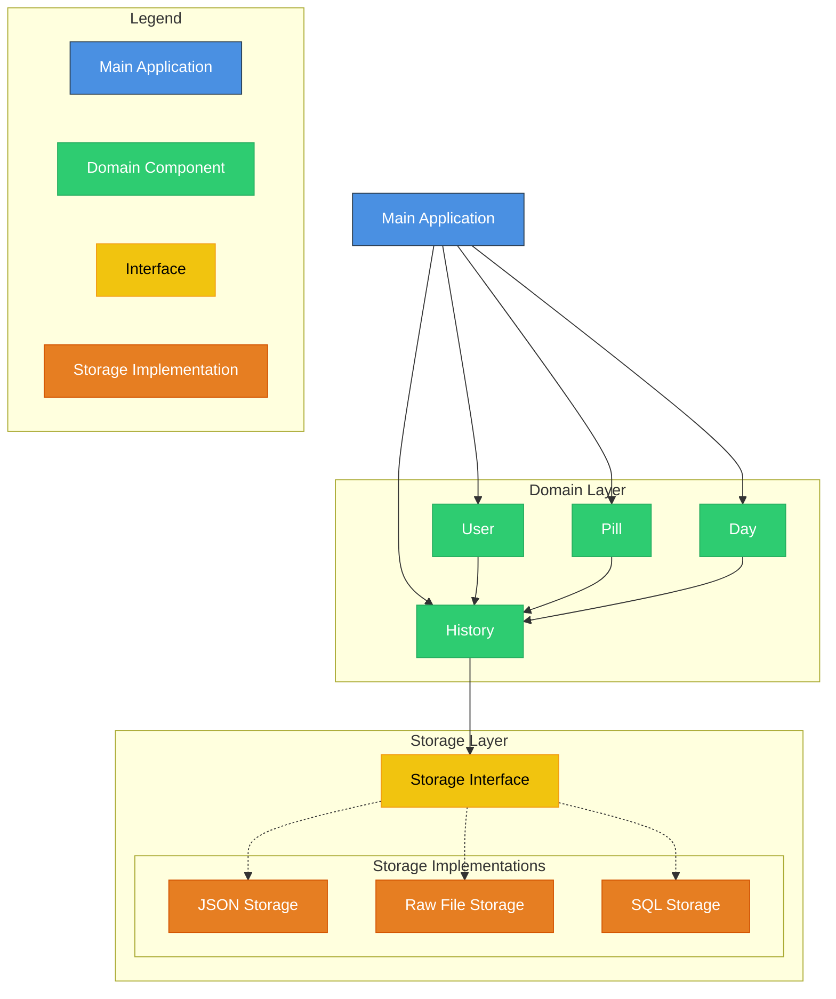

# pills_project

# Graphs

```mermaid
graph TB
    %% Main Application
    Main["Main Application"]:::main
    click Main "https://github.com/luchoss10/pills_project/blob/main/main.py"

    %% Domain Layer
    subgraph DomainLayer["Domain Layer"]
        User["User"]:::domain
        Pill["Pill"]:::domain
        Day["Day"]:::domain
        History["History"]:::domain
        click User "https://github.com/luchoss10/pills_project/blob/main/user.py"
        click Pill "https://github.com/luchoss10/pills_project/blob/main/pill.py"
        click Day "https://github.com/luchoss10/pills_project/blob/main/day.py"
        click History "https://github.com/luchoss10/pills_project/blob/main/history.py"
    end

    %% Storage Layer
    subgraph StorageLayer["Storage Layer"]
        StorageInterface["Storage Interface"]:::interface
        click StorageInterface "https://github.com/luchoss10/pills_project/blob/main/storage_modules/data_save_interface.py"
        click StorageModules "https://github.com/luchoss10/pills_project/blob/main/storage_modules/__init__.py"
        
        subgraph StorageImplementations["Storage Implementations"]
            JSONStorage["JSON Storage"]:::storage
            RawStorage["Raw File Storage"]:::storage
            SQLStorage["SQL Storage"]:::storage
            click JSONStorage "https://github.com/luchoss10/pills_project/blob/main/storage_modules/json_file_storage.py"
            click RawStorage "https://github.com/luchoss10/pills_project/blob/main/storage_modules/raw_file_storage.py"
            click SQLStorage "https://github.com/luchoss10/pills_project/blob/main/storage_modules/sql_file_storage.py"
        end
    end

    %% Relationships
    Main --> User
    Main --> Pill
    Main --> Day
    Main --> History
    
    User --> History
    Pill --> History
    Day --> History
    
    History --> StorageInterface
    
    StorageInterface -.-> JSONStorage
    StorageInterface -.-> RawStorage
    StorageInterface -.-> SQLStorage

    %% Styles
    classDef main fill:#4a90e2,stroke:#2c3e50,color:white
    classDef domain fill:#2ecc71,stroke:#27ae60,color:white
    classDef interface fill:#f1c40f,stroke:#f39c12,color:black
    classDef storage fill:#e67e22,stroke:#d35400,color:white

    %% Legend
    subgraph Legend
        MainL["Main Application"]:::main
        DomainL["Domain Component"]:::domain
        InterfaceL["Interface"]:::interface
        StorageL["Storage Implementation"]:::storage
    end
```
